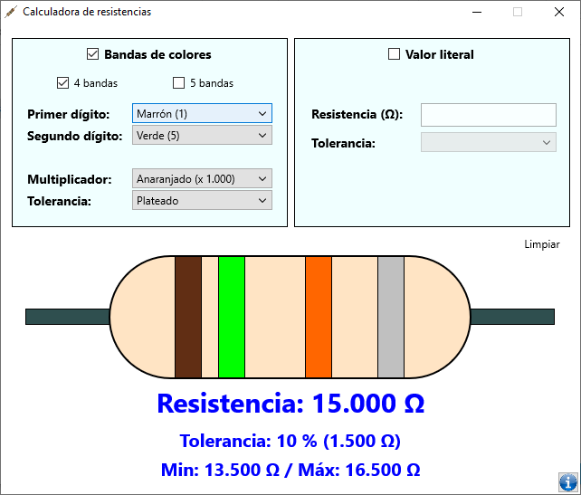

# Calculadora de Resistencias

---

## Descripción

Sencilla calculadora de resistencias o resistores, que permite hacerlo tanto por los colores como el valor literal de la resistencia en ohms.

## Notas

* Compilado para 32 y 64 bits.

---

## Lenguaje/framework/base de datos

* Lenguaje: Delphi 10.2 Tokyo, empleando sólo componentes nativos. 
* Framework: Firemonkey. 

---

## Instalación

No requiere de instalación y es totalmente portable.

---

## Autor

Ing. Francisco José Sáez Soto.

e-mail: **fjsaez@gmail.com**

LinkedIn: **linkedin.com/in/francisco-josé-sáez-soto**

GitHub: **github.com/fjsaez**

---

Calabozo (Venezuela), noviembre de 2020.

---

## Link de descarga de ejecutables

32 bits: https://mega.nz/file/LtN32AZQ#qeAPHxjUmxGQchbKrPZ6pGdzJlmsaKfIkXxDbetr22s

64 bits: https://mega.nz/file/D4030SqL#GrTo_Ch39-Do_bRPtDH7h6S8T538N538LHLufY5TUgQ

## Imágenes de la aplicación

### Icono

### Pantalla principal

### Acerca...

